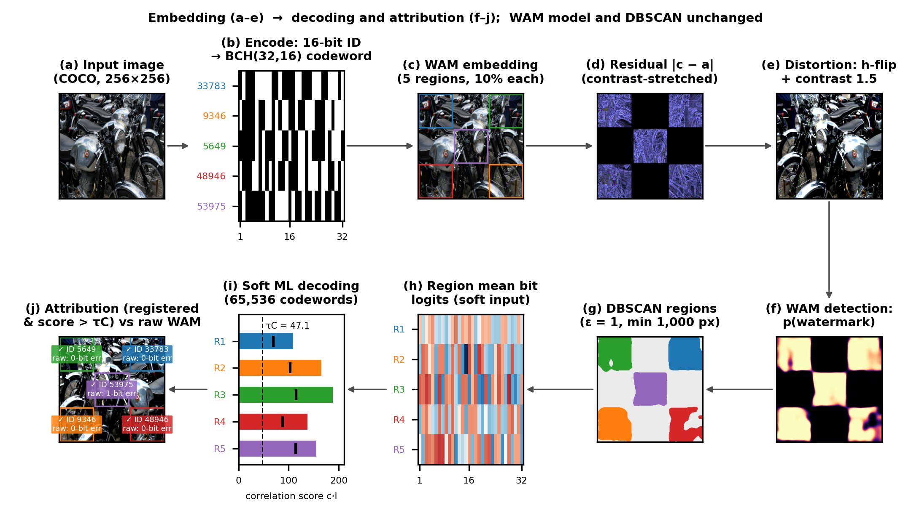
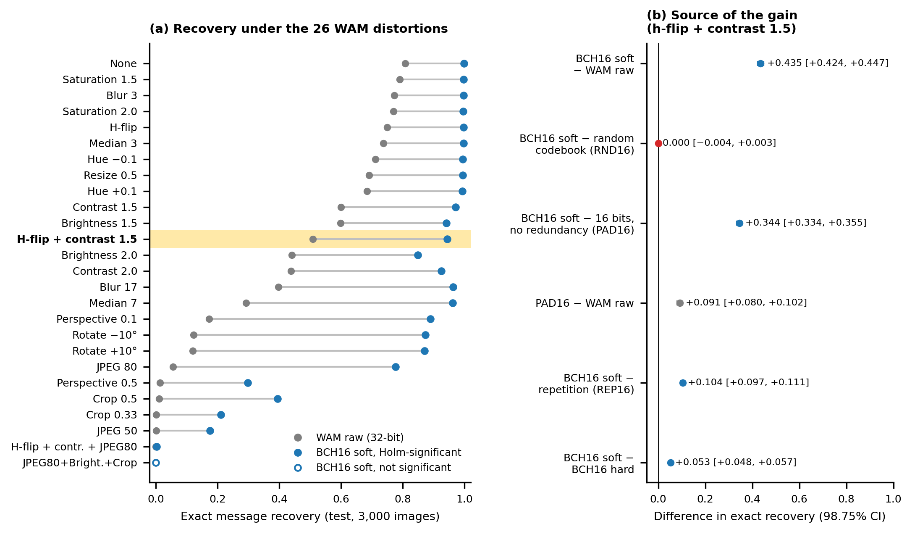
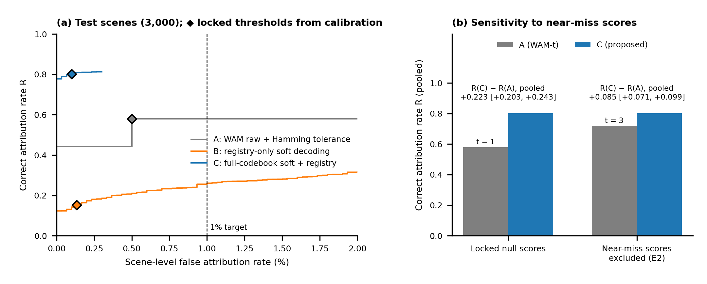
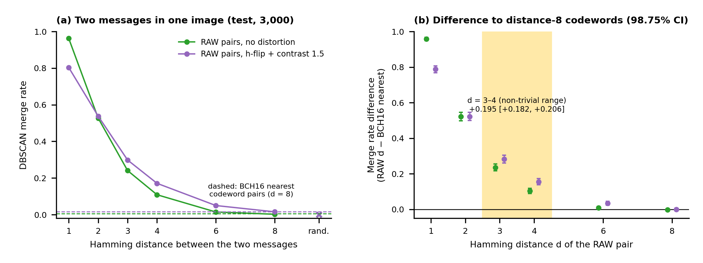
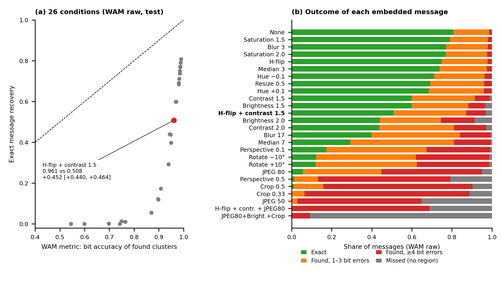

# CCMW — Codebook-Constrained soft decoding and calibrated attribution for localized Multi-message Watermarks

We provide the code, the locked execution protocol, the result files, figures and tables for the paper

> **Codebook-constrained soft decoding improves exact message recovery and calibrated user attribution in localized multi-message image watermarks**

We do **not** propose a new watermarking model, and we do not retrain one. We keep [Watermark Anything (WAM)](https://github.com/facebookresearch/watermark-anything) (Sander et al., ICLR 2025) and its multi-message scene construction unchanged and change only two steps: (i) before embedding, messages are restricted to the codewords of the extended BCH(32,16) code; (ii) after WAM's DBSCAN clustering, every region is decoded by soft maximum-likelihood search over all 65,536 codewords, and an identity is accepted only if it is registered and its score exceeds a conformally calibrated threshold. We fixed the hypotheses, decision rules and protocol before testing, recorded them by SHA-256, and tested four hypotheses (H1–H4) on 3,000 COCO val2017 test images. All four were supported.

[](figures/fig1_flow.pdf)

_Figure 1 — We follow one reserve image (COCO val2017 `000000524108.jpg`, Attribution License, CC BY 2.0) through embedding (a–e) and decoding with calibrated attribution (f–j). The WAM model and its DBSCAN clustering are unchanged. All five registered IDs were accepted. The raw WAM readout of the same image carrying random 32-bit messages recovered 4 of the five messages exactly. The figure illustrates the flow; it is not a statistic._

* * *

## 1. Method

For a detected region R_r, WAM's extractor returns per-pixel bit logits L_i ∈ ℝ³². We average them, l_r = (1/|R_r|) Σ_{i∈R_r} L_i, and decode

ĉ_r = argmax_{c ∈ 𝒞} ⟨c, l_r⟩, score s_r = ⟨ĉ_r, l_r⟩, with codewords written as c ∈ {−1, +1}³².

Because all codewords have the same norm, this is maximum-likelihood decoding under the simplified model l_r = a·c* + e with a common gain a > 0 and e ~ N(0, σ²I) (an assumption, not verified on the data). The 65,536 × 32 correlation is one matrix product on the GPU.

| Decoder | Input | Rule |
|---|---|---|
| WAM raw (baseline) | DBSCAN centroid (majority bits of the region) | read directly as the 32-bit message |
| BCH16 hard | DBSCAN centroid | nearest codeword in Hamming distance |
| **BCH16 soft (ours)** | mean bit logits l_r | argmax correlation over all 65,536 codewords |

Comparison codebooks (all decoded with the same soft decoder): RND16 (65,536 random 32-bit words), REP16 (16 information bits repeated twice), PAD16 (16-bit ID followed by a fixed 16-bit suffix, which adds no distance between IDs and no error correction), BCH21 (extended BCH(32,21), minimum distance 6).

| Attribution rule | Accept a region if | Threshold (calibrated on 1,000 cal images, α = 0.002) |
|---|---|---|
| A — WAM-t (baseline) | the raw message is within Hamming distance t of a registered message | t = 1 |
| B — registry soft decoding | soft decoding within the registry only; margin best − second best > τ_B | τ_B = 90.50 |
| **C — full-codebook soft decoding + registry check (ours)** | the best of all 65,536 codewords is a registered ID and s_r > τ_C | τ_C = 47.08 |

All three thresholds use the same conformal rank rule. For each calibration scene t the null score z_t is the largest score of a region decoded to a registered ID that was not embedded, and τ = z_(m+1) with m = ⌊α(n+1)⌋ − 1. Under exchangeability, P(z_new > τ) ≤ (m+1)/(n+1) ≤ α; the guarantee is marginal (over calibration sets and new scenes), and ties at −∞ only make it conservative. The calibration level α is stricter than the 1% criterion of H2, which is checked on the test scenes with a one-sided Clopper–Pearson upper confidence bound. This holds for scenes distributed like the calibration scenes, not for inputs crafted by an attacker. The registry holds 1,000 BCH16 IDs and 1,000 random 32-bit messages (seed 20261100).

## 2. Pre-specified hypotheses and results

The protocol `configs/protocol_v5.json` (SHA-256 `1b2a2d0fe9a0c7aaa9ecb5bb1557a6ed3c019eb86c90360d84504727748336dd`) was locked at 2026-10-04T13:14:25Z (`configs/protocol_v5_lock.json`). The lock also covers the WAM checkpoints, the per-split image lists and the measurement code; the test images were not measured before the lock. The locks are SHA-256 hashes that we recorded ourselves: they show that the locked files were not changed afterwards, but they do not independently certify when the files were created, because the plans were not deposited with an external registry before testing. The four hypothesis tests are the primary analyses; E1–E4, E3b, R4 and F16 are supplementary analyses with plans locked before measurement; R3 and the H2 estimand analysis are post hoc analyses of existing records.

| | Hypothesis | Locked decision rule | Test result | Verdict | Shown in |
|---|---|---|---|---|---|
| H1 | Codebook-constrained soft decoding recovers more messages exactly than WAM raw decoding | Lower bound of BCH16 soft − WAM raw > 0 (h-flip + contrast 1.5, k = 1–5 pooled) | 0.508 → 0.944; +0.435 [+0.424, +0.447] | Supported | Fig. 2 |
| H2 | Calibrated full-codebook attribution (C) attributes more messages correctly than Hamming-tolerance attribution (A) at ≤ 1% false attribution | One-sided 98.75% upper bounds on scene-level false attribution ≤ 1% for A and C; lower end of the 98.75% interval of Δ_img (C − A) > 0 (mixed scenes) | C 3/3,000 (≤ 0.32%), R 0.802; A 15/3,000 (≤ 0.87%), R 0.579 (pooled); per-image mean difference +0.213 [+0.193, +0.233] (pooled +0.223 [+0.203, +0.243]) | Supported | Fig. 3 |
| H3 | DBSCAN merges messages that are close in Hamming distance; codewords at distance 8 are rarely merged | (1) RAW d = 1 − RAW random > 0; (2) RAW d ≤ 4 − BCH16 nearest > 0 (lower bounds) | (1) +0.883 [+0.872, +0.893]; (2) +0.446 [+0.437, +0.456]; d = 3–4: +0.195 [+0.182, +0.206] | Supported | Fig. 4 |
| H4 | WAM's multi-message metric overestimates exact message recovery | Lower bound of WAM metric − exact recovery > 0 (h-flip + contrast 1.5) | 0.961 vs 0.508; +0.452 [+0.440, +0.464]; failures: 6.1% missed, 73.7% 1–3-bit, 20.2% ≥4-bit | Supported | Fig. 5 |

Test set: 3,000 COCO val2017 images; the primary evaluation was run once after the protocol was locked (SHA-256 1b2a2d0f…); checkpoint wam_coco. Intervals: 98.75% image-paired bootstrap (10,000 resamples; Bonferroni over four hypotheses). False-attribution bounds: one-sided Clopper–Pearson 98.75%. R is pooled over messages (R_msg); the H2 decision statistic Δ_img is the mean per-image difference in correct attribution. H3 (1) and H4 are expected from the definitions of DBSCAN (ε = 1) and of the WAM metric; their information is in the size and causes. The distance 3–4 difference (H3), the failure decomposition (H4) and the pooled H2 difference are post hoc analyses of the test records.

## 3. Setup

| Item | What we used |
|---|---|
| Model | WAM at commit `2c08af04d037d5667c02f6ddebbda9ff04581c3e` (unchanged); `wam_coco.pth` (the checkpoint evaluated in the WAM paper; all decisions, sha256 `e8d65bd1278e63aa…`), `wam_mit.pth` (secondary check, sha256 `90ef232384e023bd…`); released embedding strength (scaling_w 2.0, scaling_i 1.0, JND attenuation) |
| Images | COCO val2017 (5,000 images), sorted by file name: development 0–499, calibration 500–1,499, test 1,500–4,499, reserve 4,500–4,999; resized to 256 × 256 |
| Scenes | WAM Sec. 5.5 layout: k = 1–5 messages, each in a square of 10% of the image on a 3 × 3 checkerboard; the same image is embedded once per message and each watermarked square is pasted onto the original |
| Distortions | 26 conditions: all WAM App. D.4 settings, JPEG 80 + brightness 1.5 + crop 0.5, and the two compound distortions of WAM Sec. 5.5 (h-flip + contrast 1.5; the same followed by JPEG 80), applied with WAM's augmentation classes |
| Detection and regions | σ(p_i) > 0.5; WAM's DBSCAN on bits (Hamming ε = 1, at least 1,000 pixels), GPU re-implementation verified identical to WAM's routine (`src/wamset/dbscan_gpu.py`) |
| Statistics | 98.75% image-paired bootstrap intervals (10,000 resamples, seed 20261006; Bonferroni over four hypotheses), one-sided 98.75% Clopper–Pearson bounds for false attribution, Holm correction for secondary comparisons (reported only) |
| H2 scenes | one scene per image (seeds: cal 20261101, test 20261102): k uniform in 0–5, distortion uniform over the 26 conditions, each message registered with probability 0.5, unregistered messages random or near-miss |
| Compute | NVIDIA RTX 4090 (24 GB), Python 3.10.12, torch 2.3.1+cu121, torchvision 0.18.1, FP32 |

## 4. Installation

```bash
python3.10 -m venv venv && . venv/bin/activate
pip install torch==2.3.1 torchvision==0.18.1 --index-url https://download.pytorch.org/whl/cu121
pip install -r requirements.txt
```

We use WAM from its own repository and do not redistribute it or its checkpoints. The measurement scripts are hash-locked, so we did not edit their absolute paths: `scripts/verify/oracle_h1.py` sets `REPO = /workspace/wam/JISA_selected_sources/watermark-anything` and `COCO = /workspace/wam/datasets/coco2017/val2017`, and every script writes its records to `/workspace/wam/artifacts/<stage>/`. Create these paths (or symbolic links to them):

```bash
mkdir -p /workspace/wam/JISA_selected_sources /workspace/wam/datasets/coco2017 /workspace/wam/artifacts
git clone https://github.com/facebookresearch/watermark-anything /workspace/wam/JISA_selected_sources/watermark-anything
git -C /workspace/wam/JISA_selected_sources/watermark-anything checkout 2c08af04d037d5667c02f6ddebbda9ff04581c3e
wget -P /workspace/wam/JISA_selected_sources/watermark-anything/checkpoints \
     https://dl.fbaipublicfiles.com/watermark_anything/wam_coco.pth https://dl.fbaipublicfiles.com/watermark_anything/wam_mit.pth
ln -s /path/to/coco2017/val2017 /workspace/wam/datasets/coco2017/val2017
ln -s /path/to/coco2017/annotations /workspace/wam/datasets/coco2017/annotations   # Figure 1 only (licences, captions)
python scripts/check_locks.py --wam /workspace/wam/JISA_selected_sources/watermark-anything --coco /workspace/wam/datasets/coco2017/val2017
```

`check_locks.py` verifies the protocol, the four addenda, the locked code files, the WAM commit, source files and checkpoints, and the SHA-256 of each of the four image lists. The scripts run from the repository root, for example `python scripts/verify/v4_test.py`. `src/wamset/` contains only the two helper modules that the scripts import (`config.py`, `dbscan_gpu.py`); the package was first written for an earlier design that we abandoned before the v5 protocol.

## 5. Images

We do not redistribute COCO. The splits are defined by file-name order (`configs/protocol_v5.json`, `"images"`); `reports/analysis/v5_image_manifest.json` lists the index range, count and first file of each split, and the lock holds the SHA-256 of each list of `name:sha256` lines. Development images fixed the methods and decision rules, calibration images were used only for the H2 thresholds, the primary H1–H4 evaluation on the test images was run once after the lock (the PAD16 comparison E3b later re-measured them under a separately locked plan), and reserve images were used only for the supplementary analyses (equal-capacity baseline, timing, image quality, forgery, Figure 1). Messages whose visible area was smaller than 1,000 pixels were excluded from the decisions and counted separately. The Figure 1 image (`000000524108.jpg`) is the 24th reserve image in name order and the first that met the selection rule of `scripts/figures/fig1_flow.py` (open licence, no person in its captions, all five codewords accepted, at least one raw readout with 1–3 bit errors); licence: [Attribution License](http://creativecommons.org/licenses/by/2.0/).

## 6. Repository layout and pipeline

```
configs/              locked protocol v5, its lock, four locked addenda (E, E3b, R4, F16) and their locks
src/wamset/           helper modules used by the scripts (progress bar, seeds, GPU DBSCAN)
scripts/verify/       measurement and analysis scripts (stages below)
scripts/figures/      figures, tables and algorithm boxes
scripts/check_locks.py, scripts/build_readme.py
reports/analysis/     summary results (JSON) of every stage
figures/              Figures 1–5 (PNG, PDF), Tables 1–2 (Markdown, LaTeX), Algorithms 1–2 (LaTeX), Figure 1 panels and data
```

| Stage | Script | Images | GPU | Output (`reports/analysis/`) |
|---|---|---|---|---|
| Oracle feasibility (WAM conditions) | `verify/oracle_h1.py` | dev 0–199 | yes | `oracle_h1_summary.json` |
| H1 pre-test (codes on WAM's 32 bits) | `verify/h1_pretest.py` | dev 0–199 | yes | `h1_pretest_summary.json` |
| V1: H1 on development data | `verify/v1_h1.py` | dev 0–499 | yes | `v1_summary.json` |
| V1b: H2/H3 on development data | `verify/v1b_h2h3.py` | dev 0–499 | yes | `v1b_summary.json` |
| V2: protocol lock | — | — | — | `configs/protocol_v5_lock.json` |
| V3: H2 calibration | `verify/v3_cal.py` | cal | yes | `v3_thresholds.json` |
| V4: test, decisions H1–H4 | `verify/v4_test.py` | test | yes | `v4_summary.json` |
| E1/E2: soft vs hard, threat-model sensitivity | `verify/extra_e1e2.py` | records of V3/V4 | no | `extra_E1_summary.json`, `extra_E2_summary.json` |
| E3/E4: equal-capacity baseline, timing | `verify/extra_e3e4.py` | reserve | yes | `extra_E3_summary.json`, `extra_E4_summary.json` |
| E3b: equal-capacity baseline on test | `verify/extra_e3b.py` | test | yes | `extra_E3b_summary.json` |
| R3: threshold stability, registry size, merging at d = 3–4, failure decomposition | `verify/review_r3.py` | records of V1b/V3/V4 | no | `review_R3_summary.json` |
| R4: image quality (PSNR, SSIM) | `verify/review_r4.py` | reserve | yes | `review_R4_summary.json` |
| F16: forgery, public vs keyed assignment | `verify/review_f16.py` | reserve | yes | `review_F16_summary.json` |
| Development H3 differences by distance | `verify/review_dev_h3.py` | records of V1b | no | `review_dev_h3_summary.json` |
| H2 estimands: pooled and per-image differences (post hoc) | `verify/review_h2_units.py` | records of V4 | no | `review_h2_units_summary.json` |
| Re-implementation of Algorithms 1–2 | `verify/algo_repro.py` | reserve + records | yes | `algo_repro_summary.json` |
| Figure 3 curves | `figures/h2_curves.py` | records of V4 | no | `fig_h2_curves.json` |
| Figure 1 | `figures/fig1_flow.py` | reserve | yes | `figures/fig1_flow.*`, `figures/fig1_data.json`, `figures/fig1/` |
| Figures 2–5, Tables 1–2 | `figures/build_results.py` | result files | no | `figures/fig2_h1.*` … `figures/fig5_h4.*`, `figures/table*.{md,tex}` |
| Algorithms 1–2 | `figures/build_algorithms.py` | result files | no | `figures/algorithms.tex` |
| README | `build_readme.py` | result files | no | `README.md` |

The scripts write their per-image records (`*.jsonl.gz`) and summaries to `/workspace/wam/artifacts/<stage>/`; we copied the summaries into `reports/analysis/`. We do not include the per-image records; they are regenerated by the scripts and are available from the corresponding author on request. V3 and V4 stop if any locked hash differs; E1–E4, E3b, R4 and F16 also check their addendum locks. R3, the development H3 recomputation and the Figure 3 curves reuse existing records without new measurement. We generate every number in this README from the files above with `scripts/build_readme.py`; `python scripts/build_readme.py --check` confirms that README.md matches them.

## 7. Results (3,000 test images, `wam_coco`, unless stated)

### H1 — Exact message recovery

Under h-flip + contrast 1.5, the decision condition, exact recovery rose from 0.508 (WAM raw) to 0.944 (BCH16 soft), +0.435 [+0.424, +0.447]. The gain was significant after Holm correction in 25 of 26 conditions. With `wam_mit` the difference was +0.259 [+0.248, +0.271]. BCH21 soft reached 0.909.

[](figures/fig2_h1.pdf)

_Figure 2 — (a) Exact recovery of WAM raw decoding and BCH16 soft decoding for the 26 distortions (k = 1–5 pooled). (b) Paired differences in the decision condition, each removing one candidate explanation of the gain._

| Comparison (decision condition) | Difference [98.75% CI] | What it tests |
|---|---|---|
| BCH16 soft − RND16 soft | 0.000 [−0.004, +0.003] | algebraic structure of BCH beyond a random codebook (equivalent within ±0.02 under this condition) |
| PAD16 soft − WAM raw | +0.091 [+0.080, +0.102] | a smaller candidate set with a fixed suffix and no error correction (test, E3b) |
| BCH16 soft − PAD16 soft | +0.344 [+0.334, +0.355] | codeword separation over 32 bits (test, E3b; reserve E3: +0.342 [+0.317, +0.368]) |
| BCH16 soft − REP16 soft | +0.104 [+0.097, +0.111] | BCH16 vs. a repetition code with 16 neighbours at distance 2 per codeword |
| BCH16 soft − BCH16 hard | +0.053 [+0.048, +0.057] | soft decoding (E1) |

Under this condition the gain therefore comes from well-separated codewords over all 32 bits and from soft decoding, not from the algebraic structure of BCH or a smaller candidate set.

<details><summary>Exact recovery for all 26 distortions</summary>

| Distortion | WAM raw | BCH16 hard | BCH16 soft | Soft − raw [98.75% CI] | Holm p |
|---|---|---|---|---|---|
| None | 0.808 | 0.991 | 0.998 | +0.190 [+0.182, +0.199] | < 0.003 |
| H-flip | 0.750 | 0.985 | 0.997 | +0.248 [+0.238, +0.257] | < 0.003 |
| Brightness 1.5 | 0.599 | 0.899 | 0.941 | +0.342 [+0.331, +0.353] | < 0.003 |
| Brightness 2.0 | 0.441 | 0.772 | 0.849 | +0.409 [+0.397, +0.420] | < 0.003 |
| Contrast 1.5 | 0.600 | 0.932 | 0.971 | +0.372 [+0.360, +0.384] | < 0.003 |
| Contrast 2.0 | 0.438 | 0.845 | 0.925 | +0.487 [+0.475, +0.500] | < 0.003 |
| Hue −0.1 | 0.712 | 0.975 | 0.994 | +0.283 [+0.272, +0.293] | < 0.003 |
| Hue +0.1 | 0.684 | 0.972 | 0.993 | +0.309 [+0.297, +0.319] | < 0.003 |
| Saturation 1.5 | 0.791 | 0.988 | 0.998 | +0.206 [+0.197, +0.216] | < 0.003 |
| Saturation 2.0 | 0.770 | 0.983 | 0.996 | +0.226 [+0.216, +0.235] | < 0.003 |
| Gaussian blur 3 | 0.772 | 0.986 | 0.998 | +0.225 [+0.216, +0.235] | < 0.003 |
| Gaussian blur 17 | 0.398 | 0.879 | 0.963 | +0.565 [+0.554, +0.578] | < 0.003 |
| Median filter 3 | 0.738 | 0.985 | 0.998 | +0.260 [+0.250, +0.270] | < 0.003 |
| Median filter 7 | 0.293 | 0.858 | 0.962 | +0.669 [+0.658, +0.680] | < 0.003 |
| JPEG 80 | 0.055 | 0.528 | 0.777 | +0.721 [+0.711, +0.731] | < 0.003 |
| JPEG 50 | 0.001 | 0.055 | 0.175 | +0.174 [+0.165, +0.183] | < 0.003 |
| Crop 0.33 | 0.002 | 0.095 | 0.211 | +0.212 [+0.202, +0.222] | < 0.003 |
| Crop 0.5 | 0.011 | 0.217 | 0.394 | +0.400 [+0.389, +0.411] | < 0.003 |
| Resize 0.5 | 0.691 | 0.973 | 0.995 | +0.304 [+0.293, +0.314] | < 0.003 |
| Rotate −10° | 0.122 | 0.694 | 0.873 | +0.751 [+0.741, +0.762] | < 0.003 |
| Rotate +10° | 0.120 | 0.692 | 0.871 | +0.751 [+0.741, +0.761] | < 0.003 |
| Perspective 0.1 | 0.173 | 0.734 | 0.890 | +0.717 [+0.709, +0.725] | < 0.003 |
| Perspective 0.5 | 0.013 | 0.169 | 0.299 | +0.285 [+0.278, +0.293] | < 0.003 |
| JPEG 80 + brightness 1.5 + crop 0.5 | 0.000 | 0.000 | 0.000 | 0.000 [0.000, 0.000] | 0.365 |
| **H-flip + contrast 1.5 (decision)** | 0.508 | 0.891 | 0.944 | +0.435 [+0.424, +0.447] | < 0.003 |
| H-flip + contrast 1.5 + JPEG 80 | 0.000 | 0.001 | 0.003 | +0.003 [+0.002, +0.004] | < 0.003 |

Holm-adjusted p for BCH16 soft − WAM raw (the bootstrap p cannot fall below 1/10,001).
</details>

### H2 — Registry attribution in mixed scenes

| Method | Calibrated threshold | False attributions | Upper bound (98.75%) | Correct attribution R |
|---|---|---|---|---|
| A — WAM-t | t = 1 | 15/3,000 | 0.87% | 0.579 |
| B — registry soft decoding | τ_B = 90.50 | 4/3,000 | 0.38% | 0.152 |
| **C — ours** | τ_C = 47.08 | 3/3,000 | 0.32% | 0.802 |

FA counts scenes in which a registered ID absent from the scene is accepted; a region of one embedded user decoded as another embedded user lowers R but is not counted in FA. B and C differ in message representation, candidate set and acceptance score, so their comparison is between complete pipelines. R is pooled over the 3,442 registered eligible messages; the pooled differences are R(C) − R(A) = +0.223 [+0.203, +0.243] and R(C) − R(B) = +0.650 [+0.625, +0.675] (image-level bootstrap, post hoc). The locked H2 decision statistic is the mean per-image difference over the 1,915 images with at least one registered eligible message: +0.213 [+0.193, +0.233] for C − A (per-image means 0.792 and 0.579) and +0.637 [+0.611, +0.662] for C − B. In the sensitivity analysis E2, the null scores from regions of near-miss messages were excluded from the existing records before recalibration (no new scenes; the near-miss messages stay embedded); A then calibrates to t = 3 (R = 0.717) and R(C) − R(A) = +0.085 [+0.071, +0.099] pooled (+0.083 [+0.068, +0.098] per image). Over 2,000 resamples of the calibration scenes, τ_C ranged from 37.2 to 71.2 (5th–95th percentile), with a median test false-attribution rate of 0.10% (95th percentile 0.30%) (R3).

[](figures/fig3_h2.pdf)

_Figure 3 — (a) False attribution versus correct attribution as the threshold varies (descriptive); diamonds mark the thresholds calibrated beforehand. (b) Sensitivity analysis E2: pooled correct attribution at the calibrated thresholds with the locked null scores and with the null scores of near-miss messages excluded; differences are pooled with image-level bootstrap intervals._

### H3 — Merging of nearby messages

H3 (1), RAW d = 1 − RAW random: +0.883 [+0.872, +0.893]; H3 (2), RAW d ≤ 4 − BCH16 nearest pairs: +0.446 [+0.437, +0.456]. The informative range is d = 3–4: +0.195 [+0.182, +0.206].

| Pair | Hamming distance | Merge rate, no distortion | Merge rate, h-flip + contrast 1.5 |
|---|---|---|---|
| RAW | 1 | 0.962 | 0.804 |
| RAW | 2 | 0.527 | 0.538 |
| RAW | 3 | 0.241 | 0.298 |
| RAW | 4 | 0.109 | 0.171 |
| RAW | 6 | 0.014 | 0.050 |
| RAW | 8 | 0.002 | 0.015 |
| RAW | random | 0.000 | 0.001 |
| BCH16 | 8 (nearest codewords) | 0.005 | 0.015 |
| BCH16 | random codewords | 0.000 | 0.000 |

[](figures/fig4_h3.pdf)

_Figure 4 — (a) DBSCAN merge rate of two messages in one image versus their Hamming distance, compared with the nearest BCH16 codeword pairs and random pairs. (b) Differences from the nearest BCH16 pairs; distance 1 is expected from ε = 1._

### H4 — Overestimation by the WAM metric

In the decision condition, WAM's multi-message metric (bit accuracy over the clusters found) was 0.961 while exact recovery was 0.508; difference +0.452 [+0.440, +0.464]. Of the failed messages, 6.1% were missed, 73.7% were found with 1–3 bit errors and 20.2% with at least 4 bit errors (R3). The 17 distortions with a WAM metric of at least 0.90 span exact recovery from 0.173 to 0.808. A panoptic-quality-style metric was the same for both decoders (0.945 and 0.945).

[](figures/fig5_h4.pdf)

_Figure 5 — (a) WAM metric versus exact recovery for the 26 distortions; dashed line, equality. (b) Outcome of every embedded message: exact, 1–3 bit errors, ≥ 4 bit errors, or missed._

### Image quality and computational cost (reserve images, supplementary)

On 500 reserve images the PSNR of BCH16 embedding differed from raw embedding by −0.0003 [−0.0015, +0.0007] dB (equivalence margin ±0.1 dB); mean PSNR 37.45 dB, SSIM 0.9676 (raw messages). The WAM paper reports 38.3 dB under its own protocol; the values are not directly comparable. Median time on an RTX 4090 with batch size 1 (90 images, h-flip + contrast 1.5): embedding 4.21 ms per message, detection 5.81 ms, DBSCAN 1.59 ms, BCH16 soft decoding of all regions 0.51 ms.

### Forgery by an attacker who knows the public codebook (500 reserve images, supplementary)

| Distortion | Target regions | Legitimate attribution PUB / KEY | KEY − PUB (98.75% CI) | Targeted impersonation, PUB | Targeted impersonation, KEY: regions (upper bound, independent regions) | Targeted impersonation, KEY: images with ≥ 1 successful region (upper bound) | Framing another registered user, KEY: K0 / median of 1,000 keys [5–95%] | Expected N/65,536 × R |
|---|---|---|---|---|---|---|---|---|
| None | 2,500 | 0.999 / 0.998 | −0.002 [−0.004, 0.000] | 2,498/2,500 | 0/2,500 (≤ 0.18%) | 0/500 (≤ 0.87%) | 1.64% / 1.48% [0.84%, 2.36%] | 1.52% |
| H-flip + contrast 1.5 | 2,500 | 0.945 / 0.948 | +0.002 [−0.006, +0.011] | 2,363/2,500 | 0/2,500 (≤ 0.18%) | 0/500 (≤ 0.87%) | 1.60% / 1.44% [0.80%, 2.24%] | 1.44% |

Supplementary analysis on the 500 reserve images (plan locked before measurement). Attacker: same WAM embedder, public codebook and decoding rule, public ID of the target; no key and no detector queries. PUB: ID = codeword index; KEY: secret permutation of IDs to codewords. Rates are per forged region (five regions per image) unless stated otherwise; region-level upper bounds treat regions as independent, the image-level column does not. Method C with the locked threshold and the registry of 1,000 IDs. Copy/replay, removal and adaptive attacks are not covered.

Calibrated acceptance controls only non-adversarial false attribution. With keyed assignment no targeted impersonation was observed in the tested setting (no image had a successful region; one-sided upper bound 0.87% for this image-level event, 0.18% per region only under an independence assumption), but forged regions were attributed to unrelated registered users at a per-region rate above 1% (median over 1,000 keys). These are per-region rates under attack, not the scene-level false-attribution rate bounded in H2.

### Reproducibility of Algorithms 1 and 2

We re-implemented both algorithms from the pseudocode (`figures/algorithms.tex`) without the study's decoding and calibration functions (`scripts/verify/algo_repro.py`). The re-implementation reproduced the decoded codeword of all 4,952 forgery-experiment regions (4,952 identical), the threshold τ = 47.07576, the test false attributions (3/3,000), R = 0.80215, and the per-region acceptance counts (2,498/2,500 without distortion, 2,363/2,500 under h-flip + contrast 1.5).

## 8. Limitations

We used one model (WAM; decisions with `wam_coco`, `wam_mit` as a check), the 5,000 COCO val2017 images (WAM used the first 10,000) and WAM's 10% checkerboard scenes at 256 × 256 pixels, without irregular masks, other areas or high resolution. The payload drops from 32 to 16 bits (65,536 IDs). Under strong compression combined with other distortions no tested decoder recovered messages. H2 concerns non-adversarial false attribution in mixed scenes with a registry of 1,000 IDs; the effect of the registry size is an approximation. A public codebook cannot resist forgery, and copying, replay, removal and adaptive attacks were not studied. The equal-capacity baseline, image quality, timing and forgery results are supplementary analyses, not locked decisions.

## Third-party material

WAM code: MIT licence ([facebookresearch/watermark-anything](https://github.com/facebookresearch/watermark-anything)); checkpoints: `wam_mit.pth` MIT, `wam_coco.pth` CC BY-NC (as listed in `configs/protocol_v5.json`); neither is redistributed here. COCO images are used under their Creative Commons licences and are not redistributed, except the Figure 1 image (Attribution License).
